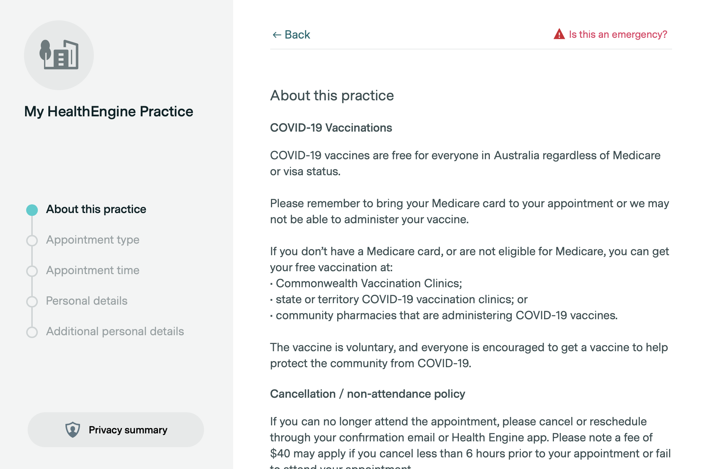

# Health Engine Pfizer Checker

This is a small Swift tool to automatically check availability of Pfizer jab appointments in clinics that use HealthEngine for bookings.

You'll need to obtain practice id. This can be done by going through [https://covid-vaccine.healthdirect.gov.au/eligibility](https://covid-vaccine.healthdirect.gov.au/eligibility) to HealthEngine enabled practice and checking URL on a page that looks similar to:



The URL should be in the following format:

`https://healthengine.com.au/v2/appointment/book_widget/12345/COVID-19%20Vaccinations?covaxEligibilityChecked=true#about-practice`

where the `12345` is the practice id.

### Usage

```
USAGE: jab --practice-id <practice-id> [--before-date <before-date>] [--period <period>]

OPTIONS:
  -P, --practice-id <practice-id>
                          Practice ID. 
  -d, --before-date <before-date>
                          Notify about appointments before given date, format: yyyy-MM-dd HH:mm 
  -p, --period <period>   Period of checks in minutes. (default: 15)
  -h, --help              Show help information.
```

Example:

```
Jab --practice-id 12345 --before-date "2021-11-01 10:50"
```

### Installation

Clone or download the project, then `swift build && .build/debug/Jab`